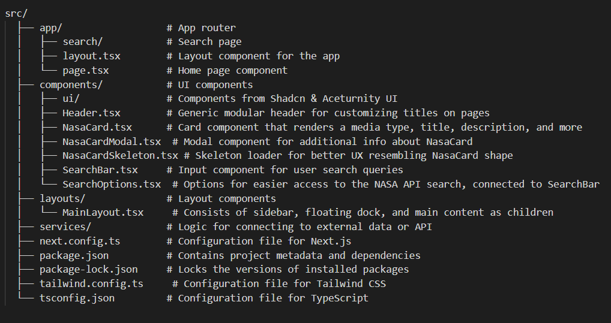

# Client-Side App

This is a client-side application built with Next.js, utilizing Tailwind CSS for styling and various components for a seamless user experience.

## Running the Client-Side App

To run the client-side application locally, follow these steps:

1. Navigate to the client directory:
   ```bash
   cd client

2. Install the dependencies:
    ```bash
    npm run i

3. Start the development server:
    ```bash
    npm run dev

## File Structuring

